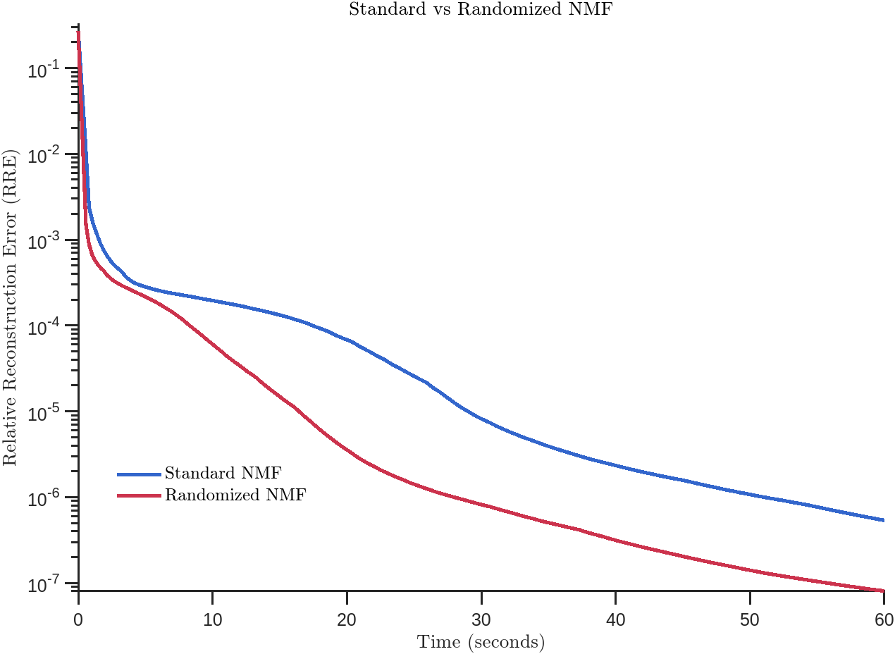

#  Faster-than-Fast NMF via Random Projections and Nesterov Iterations

This repository contains MATLAB code for efficient Non-negative Matrix Factorization (NMF) using **random projections** and **Nesterov's optimal gradient method**. It includes both the standard NMF solver and an accelerated variant based on dimensionality reduction techniques.

The code is based on my paper:

> **F. Yahaya**, M. Puigt, G. Delmaire, and G. Roussel
> *Faster-than-fast NMF using random projections and Nesterov iterations*
> arXiv preprint [arXiv:1812.04315](https://arxiv.org/abs/1812.04315)

If you use this code in your research or project, please **cite the paper** above.

Running the `demo.m` script performs a side-by-side comparison of **standard NMF** vs **randomized NMF** on synthetic data, under a time constraint (e.g. 60 seconds).

The plot below shows the **Relative Reconstruction Error (RRE)** over time. The randomized version converges faster with comparable final error, highlighting the benefit of **sketching-based compression**:

<div align="center">
  
</div>

## Related publications

This code is the algorithmic foundation for a series of papers on random-projection-accelerated NMF. The most comprehensive treatment is in the *IEEE TSP* 2024 journal article.

- **F. Yahaya** *et al.*, "A framework for compressed weighted nonnegative matrix factorization," *IEEE Transactions on Signal Processing*, 2024.
- **F. Yahaya** *et al.*, "Random projection streams for (weighted) nonnegative matrix factorization," *Proc. ICASSP*, 2021.
- **F. Yahaya** *et al.*, "How to apply random projections to nonnegative matrix factorization with missing entries?," *Proc. EUSIPCO*, 2019.

---

## 📌 Citation

```bibtex
@article{yahaya2018faster,
  title={Faster-than-fast NMF using random projections and Nesterov iterations},
  author={Yahaya, Farouk and Puigt, Matthieu and Delmaire, Gilles and Roussel, Gilles},
  journal={arXiv preprint arXiv:1812.04315},
  year={2018}
}
```

For the journal version (recommended):

```bibtex
@article{yahaya2024framework,
  title={A framework for compressed weighted nonnegative matrix factorization},
  author={Yahaya, Farouk and Puigt, Matthieu and Delmaire, Gilles and Roussel, Gilles},
  journal={IEEE Transactions on Signal Processing},
  year={2024}
}
```

## License

MIT. See [LICENSE](LICENSE).
